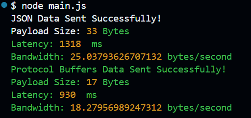

# JSON vs Protocol buffers

- create objects with same data in protobuf and json.
- compare length of the buffer of both the message formats 
- send request using both message formats on axios protocol to [requestbin](https://pipedream.com/requestbin)
- compare latency and bandwidth of both the requests.

Results:

# Local setup instructions.
- create a request bin [here](https://pipedream.com/requestbin) and get the generated url.
- create .env file in root dir and add that url here `REQUEST_BIN_URL=<your_url>`
- npm install and node main.js

